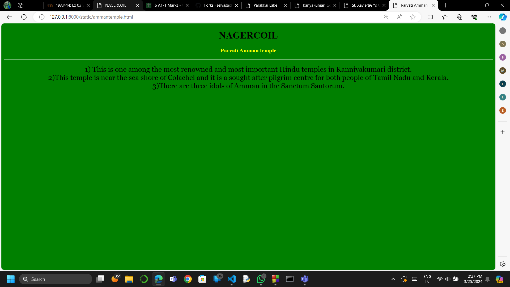
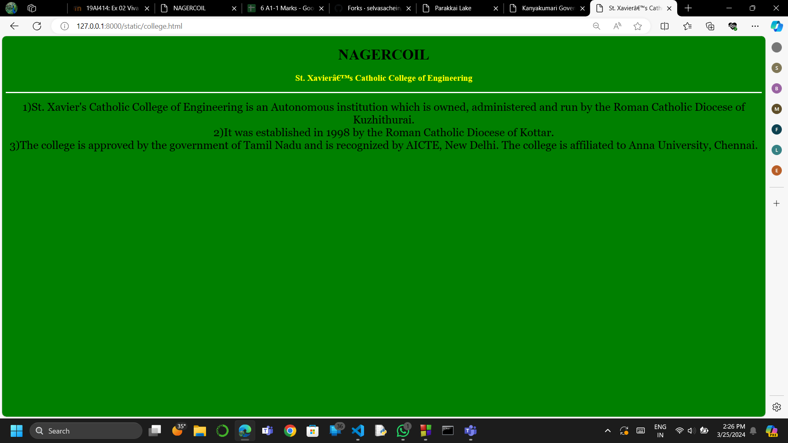
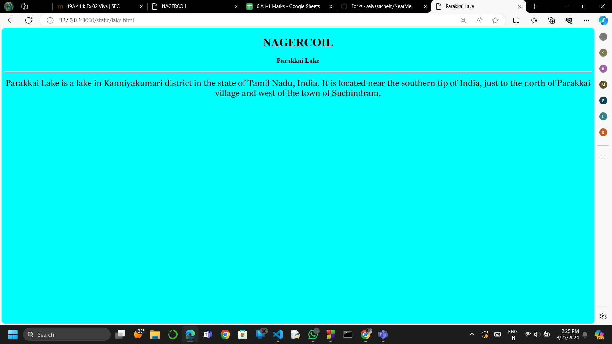

# Ex04 Places Around Me
## Date:20.03.2024

## AIM
To develop a website to display details about the places around my house.

## DESIGN STEPS

### STEP 1
Create a Django admin interface.

### STEP 2
Download your city map from Google.

### STEP 3
Using ```<map>``` tag name the map.

### STEP 4
Create clickable regions in the image using ```<area>``` tag.

### STEP 5
Write HTML programs for all the regions identified.

### STEP 6
Execute the programs and publish them.

## CODE
```
map.html

<!DOCTYPE html>
<html>
<head>
<title>NAGERCOIL</title>
</head>
<body>
<h1 align="center"><b>KANYAKUMARI</b></h1>
<h3 align="center"><b> SHREE LEKHA.S(212223110052)</b></h3>
<center>

<map name="CHENNAI">
<area shape="rectangle" coords="750,500,900,800" href="collegeandhospital.html"  title="Kanyakumari Government Medical College and Hospital">
<area shape="rectangle" coords="600,300,900,800" href="college.html"  title="St. Xavier’s Catholic College of Engineering">
<area shape="rectangle" coords="700,200,900,400" href="ammantemple.html"  title="Parvati Amman temple">
<area shape="rectangle" coords="600,200,700,600" href="temple.html"  title="Shri Nagaraja Temple">
<area shape="rectangle" coords="900,100,200,300" href="lake.html"  title="Parakkai Lake">
</map>
</center>
</body>
</html>

```
```
ammantemple.html

<!DOCTYPE html>
<html>
<head>
<title>Parvati Amman temple</title>
</head>
<body bgcolor="green">
<h1 align="center">
<font color="black"><b>NAGERCOIL</b></font>
</h1>
<h3 align="center">
<font color="yellow"><b>Parvati Amman temple</b></font>
</h3>
<hr size="3" color="white">
<p align="center">
<font face="Georgia" size="5">
1) This is one among the most renowned and most important Hindu temples in Kanniyakumari district.<br>
2)This temple is near the sea shore of Colachel and it is a sought after pilgrim centre for both people of Tamil Nadu and Kerala.<br>
3)There are three idols of Amman in the Sanctum Santorum.
</p>
</body>
</html>

```
```
college.html

<!DOCTYPE html>
<html>
<head>
<title>St. Xavier’s Catholic College of Engineering</title>
</head>
<body bgcolor="green">
<h1 align="center">
<font color="black"><b>NAGERCOIL</b></font>
</h1>
<h3 align="center">
<font color="yellow"><b>St. Xavier’s Catholic College of Engineering</b></font>
</h3>
<hr size="3" color="white">
<p align="center">
<font face="Georgia" size="5">
1)St. Xavier's Catholic College of Engineering is an Autonomous institution which is owned, administered and run by the Roman Catholic Diocese of Kuzhithurai.<br>
2)It was established in 1998 by the Roman Catholic Diocese of Kottar.<br>
3)The college is approved by the government of Tamil Nadu and is recognized by AICTE, New Delhi. The college is affiliated to Anna University, Chennai.
</p>
</body>
</html>

```
```
collegeandhospital.html

<!DOCTYPE html>
<html>
<head>
<title>Kanyakumari Government Medical College and Hospital</title>
</head>
<body bgcolor="green">
<h1 align="center">
<font color="black"><b>NAGERCOIL</b></font>
</h1>
<h3 align="center">
<font color="yellow"><b>Kanyakumari Government Medical College and Hospital</b></font>
</h3>
<hr size="3" color="white">
<p align="center">
<font face="Georgia" size="5">
1)Kanyakumari Government Medical College is a prominent institution located in Nagercoil, Tamil Nadu, India. <br>
2)Kanyakumari Government Medical College offers MBBS, MD, and MS courses.<br>
3)The college campus houses the Government T.B. Hospital, which was renamed as Kanyakumari Government Medical College.
</p>
</body>
</html>

```

```
lake.html

<!DOCTYPE html>
<html>
<head>
<title>Parakkai Lake</title>
</head>
<body bgcolor="cyan">
<h1 align="center"><b>NAGERCOIL</b></h1>
<h3 align="center"><b>Parakkai Lake</b></h3>
<hr size="3" color="white">
<p align="center">
<font face="Georgia" size="5">
 Parakkai Lake is a lake in Kanniyakumari district in the state of Tamil Nadu, India. It is located near the southern tip of India, just to the north of Parakkai village and west of the town of Suchindram.
</p>
</body>
</html>

```

```
temple.html

<!DOCTYPE html>
<html>
<head>
<title>Shri Nagaraja Temple</title>
</head>
<body bgcolor="green">
<h1 align="center">
<font color="black"><b>NAGERCOIL</b></font>
</h1>
<h3 align="center">
<font color="yellow"><b>Shri Nagaraja Temple</b></font>
</h3>
<hr size="3" color="white">
<p align="center">
<font face="Georgia" size="5">
1)Nagaraja Temple is an early large temple found in the city of Nagercoil (Nagarkōyil) near the southern tip of Tamil Nadu, India.<br>
2)The main sanctum is dedicated to the Nagaraja – the king of serpents<br>
3)The original iconography of the Tirthankaras and Padmavati Devi have and continue to remain a part of the sacred pantheon close to the temple's main sanctum.
</p>
</body>
</html>


```
## OUTPUT









## RESULT
The program for implementing image maps using HTML is executed successfully.
